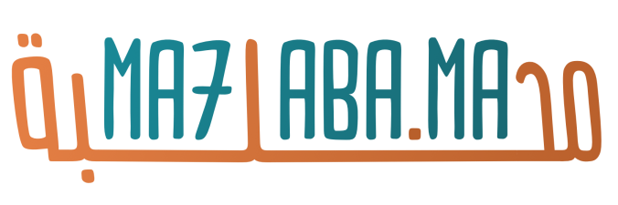
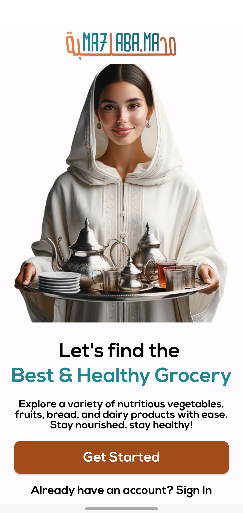
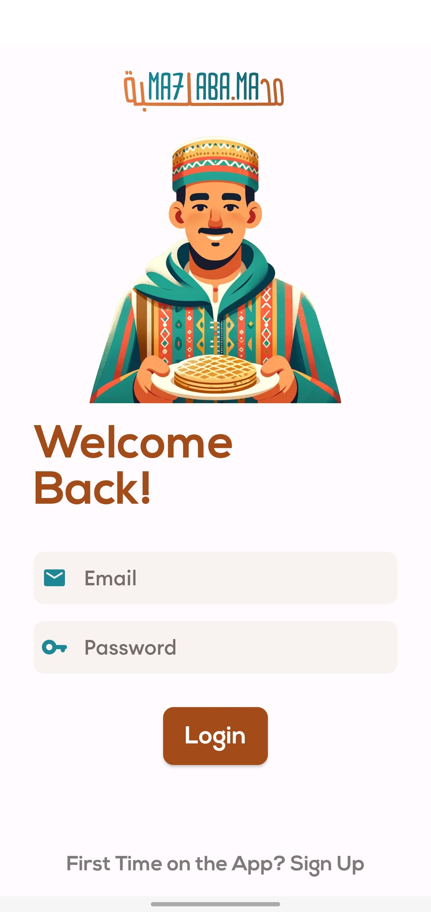
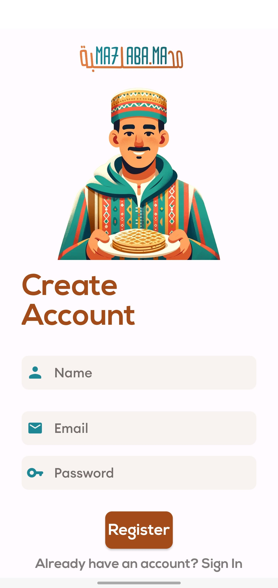
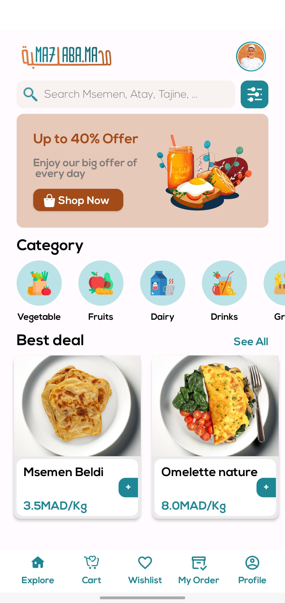
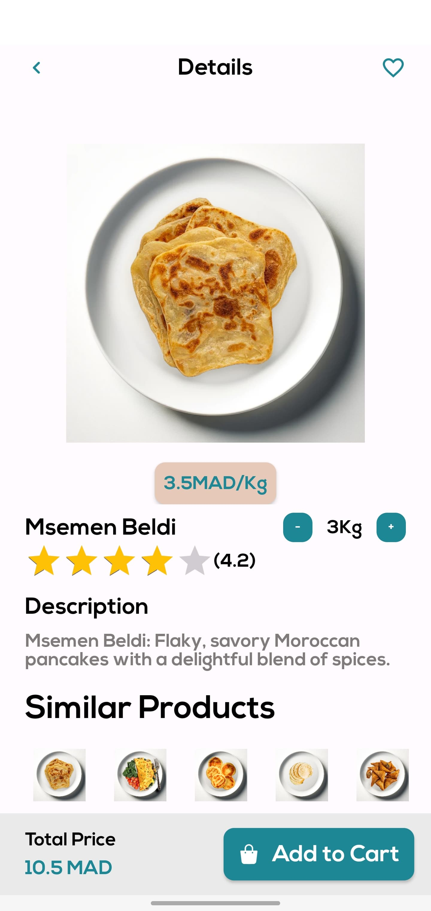
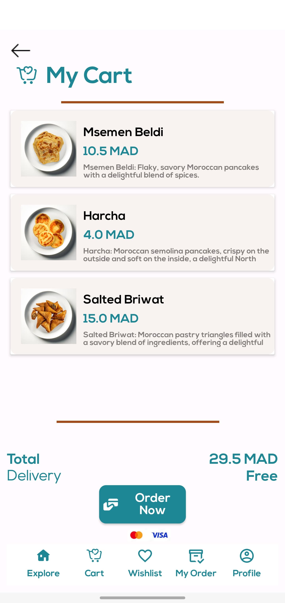
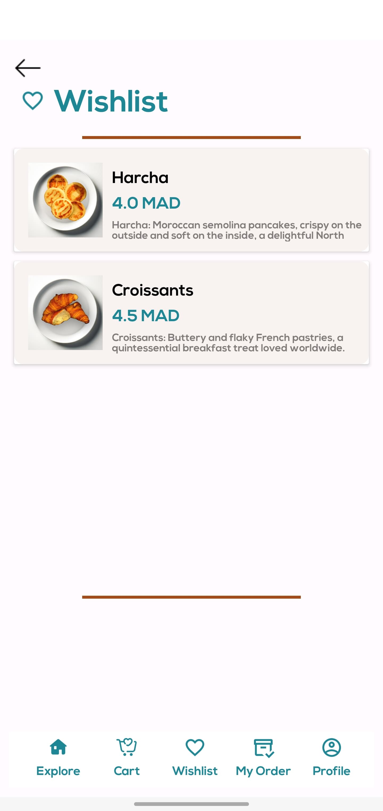

# Mahlaba.ma 🥛

  

> *Slogan* - "ممنوع الطلق والرزق على الله"
 

# 🧀 🇲🇦 CEOs

👩‍🍳 [@Khadija Bayoud](https://github.com/Khadija-Bayoud) - Moulat Lmsemen 

💵 [@Mohammed Machrouh](https://github.com/medmac01) - Caissier Grad 0

 

# 👀 Problem

There is a lack of a comprehensive and user-friendly platform dedicated to the promotion, sale, and exploration of Moroccan culinary delights through a dedicated Android app. The absence of such a platform hinders the effective showcasing and accessibility of diverse Moroccan food items, potentially limiting the exposure and market reach for local culinary businesses and depriving users of a convenient and centralized means to discover, purchase, and savor the rich gastronomic offerings of Morocco.
   

# 💭 Proposal

Mahlaba.ma is your ultimate Android app for selling and showcasing Moroccan culinary treasures. From the flaky delights of harcha and msemen to the aromatic wonders of tajine, explore, sell, and savor the essence of Morocco—all in one convenient platform.
   

# 🔑 Key features :

| **IntroActivity Interface** | **LoginActivity Interface** | **RegisterActivity Interface** |
|:---------------------------:|:---------------------------:|:-----------------------------:|
| 

 | 

 | 

 |

| **MainActivity Interface** | **DetailActivity Interface** | **CartActivity Interface** |
|:---------------------------:|:---------------------------:|:-------------------------:|
| 

 | 

 | 

 |

| **WishListActivity Interface** |
|:-----------------------------:|
| 

 |

# 🎨✨ Design : 
Our Android app boasts a meticulously crafted design that is not only visually appealing but also authentically reflects the vibrant essence of Moroccan culture and culinary traditions. Every aspect of our app, from the layout to the icons and drawables, has been thoughtfully curated to embody the rich and diverse heritage of Morocco. The use of original icons and drawables is a testament to our commitment to showcasing the uniqueness of Moroccan culinary treasures. 
   

# 💡 Impact
The impact of this application is multifaceted and significant. Firstly, it provides a robust platform for local Moroccan culinary businesses to reach a broader audience, fostering economic growth within the industry. By facilitating the sale of authentic Moroccan culinary treasures, the app contributes to the sustainability and visibility of small businesses, thereby supporting the local economy. The application serves also as a cultural ambassador, promoting and preserving the rich heritage of Moroccan cuisine. 
   

